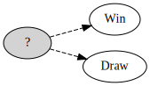
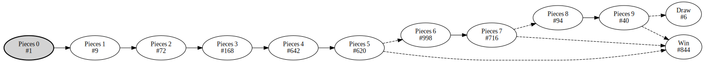

# Tic-Tac-TLA
Tic-Tac-Toe modeled in TLA+.

The first player (`X`) is modeled to only make strong moves. So it will never lose.

## State-space projections
Based on the techniques presented in [TLA+ Conf 24 - Daniel Stachnik - Tackling State Space Explosion In TLA+ Visualizations](https://www.youtube.com/watch?v=CSl4uC9MZJM).

### Turn
Projection that shows that players take turns.

### Outcome
Projection that shows the possible outcomes of a game.

### Game progression
Projection that shows the number of pieces on the board and the terminal states.

