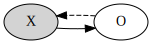

# Tic-Tac-TLA
Tic-Tac-Toe modeled in TLA+.

The first player (`X`) is modeled to only make strong moves. So it will never lose.

## State-space projections
Based on the techniques presented in the [TLA+ Conf 24 - Daniel Stachnik - Tackling State Space Explosion In TLA+ Visualizations](https://www.youtube.com/watch?v=CSl4uC9MZJM) video and the [Mastering the Visualization of Larger State Spaces with Projection Diagrams](https://stups.hhu-hosting.de/downloads/pdf/LadenbergerLeuschel_ProjectDiagram.pdf) paper.

### Legend
#### Nodes
Nodes represent a equivalence class. This is a collection of states with the same projection.
- Gray: Equivalence class contains initials states.
- Bold outline: Single state within the equivalence class.

#### Edges
Edges represent a collection of transitions.
- Solid line: Definite, all states within an equivalence class can make a transition *e*. But for each state the transition *e* might move to different equivalence classes.
- Dashed line: Non-definite, when it is not definite.
- Black line: Semi-deterministic, All states within an equivalence classes that can make a transition *e*, move to the same destination equivalence class.
- Gray line: Non-deterministic, when it is not semi-deterministic.

### Turn
Projection that shows that players take turns.

### Outcome
Projection that shows the possible outcomes of a game.

### Game progression
Projection that shows the number of pieces on the board and the terminal states. This visualization also shows the initial state and the number of original states represented by each projected state.

